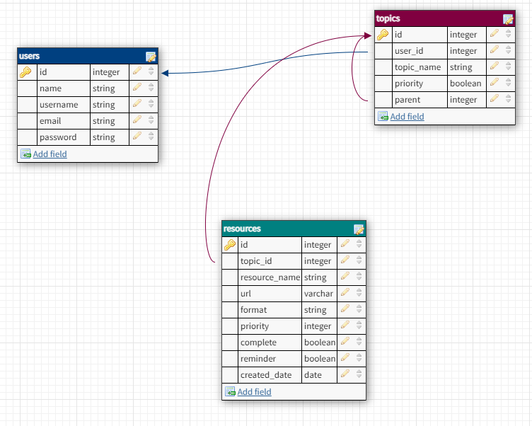

# Project description
In these days and age it is very common to save a lot of online resources for different topics that interest us and that we want to use in a second moment.
The problem is that then we forget about them, we save new resources and we never come back to them.
groupIT! is thought as the solution to this modern problem. This app will allow the user to save online resources, cathegorize them by topics and subtopics and be reminded of them if they haven't come back at the resource in a long time.

[First brainstorming about the organization and planification of the project](client/public/Plannification_GroupIt.png)

[Wireframe]((client/public/Wireframe_GroupIt.png))

# Project Setup

## Dependencies
- Run `npm install` in project directory. This will install server-related dependencies such as express, axios, bycript, jsonwebtoken, nodemailer and crone.
- Run `cd client` and run `npm install`. This will install client dependencies (React).


## Database Prep
Access the MySQL interface in your terminal by running `mysql -u root -p`
Create a new database: `create database projectname`
Add a .env file to the project folder of this repository containing the MySQL authentication information for MySQL user. For example:

```javascript
DB_HOST = localhost;
DB_USER = root;
DB_NAME = bodyCultureBcn;
DB_PASS = YOURPASSWORD;
SUPER_SECRET = YOURSECRET;
```
- Run `npm run migrate` in the project folder of this repository, in a new terminal window. This command is a script that will run Sequelize to create 3 tables called 'users','topics' and 'resources' in your database.

- Make sure you understand how all the tables are constructed. In your MySQL console, you can run `use database name_of_your_table`; and then `show tables`; to see the structure of the table. Run `describe users` in case you want to check the content of the users table. You can do the same with the rest of the tables.



### Table endpoints
You can find the API routes plan here: 
[endpoints](https://docs.google.com/spreadsheets/d/1RpaiDPJPZXJc77Qzjmz_yS_Hdr2mjb0nf4W578ph8tk/edit#gid=0)

## Development
- Run `npm start` in project directory to start the Express server on port 5000
- In another terminal, do `cd client` and run `npm start` to start the client in development mode with hot reloading in port 3000.

## Stack
- Main stack: JavaScript, React.js, Express.js, Node.js, mySQL
- Dependencies: [axios](https://github.com/axios/axios), [Sequelize](https://sequelize.org/master/index.html), [React-Router](https://reactrouter.com/web/guides/quick-start), [nodemailer](https://nodemailer.com/about/), [cron](https://github.com/axios/axios)
- Style: CSS, [Bootstrap](https://getbootstrap.com/)
- Wireframe: [Invision](https://www.invisionapp.com/)
- Deployment: [Heroku](www.heroku.com)

## Future features
- Improve styling
- Add a process bar, where the user can see the percentage completed of all the resources in the list.
- Edit the name of the resource once is added in the resources dashboard.
- Get the resources by different filters (by topic, subtopic, format, if it is completed or not...).
- Be able to edit the name of the resource (WIP)
- Reset password (only works in development mode, so far)

_This is a student project that was created at [CodeOp](http://codeop.tech), a full stack development bootcamp in Barcelona._

